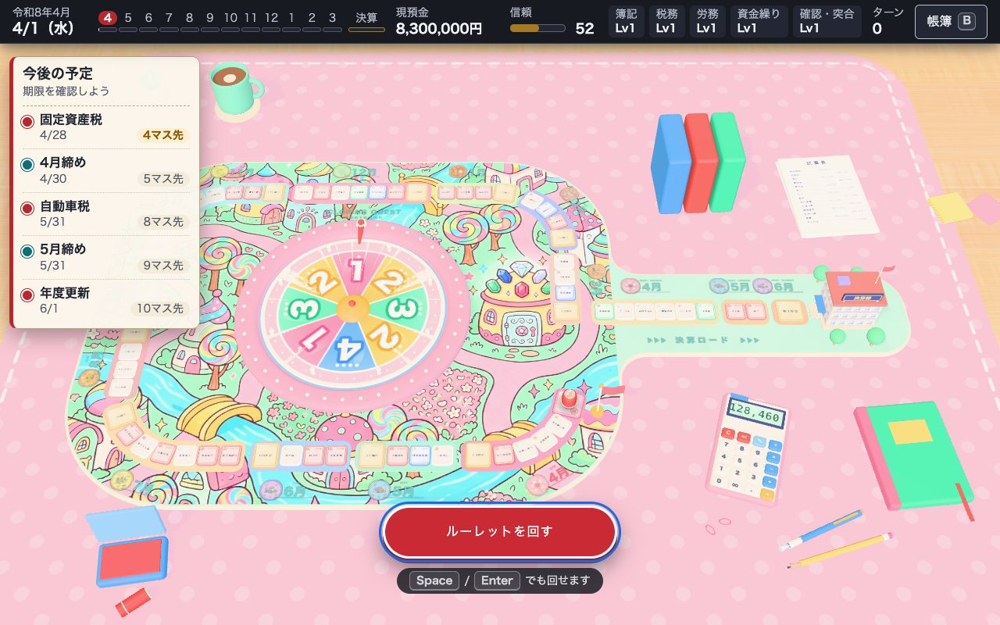
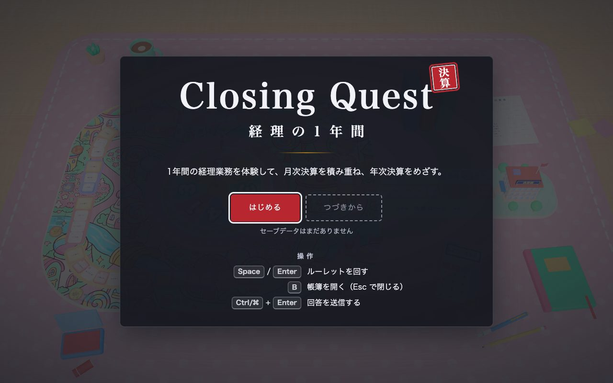
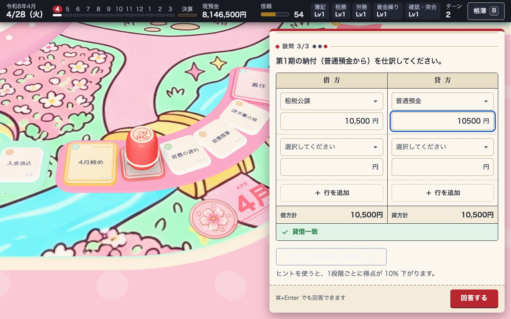
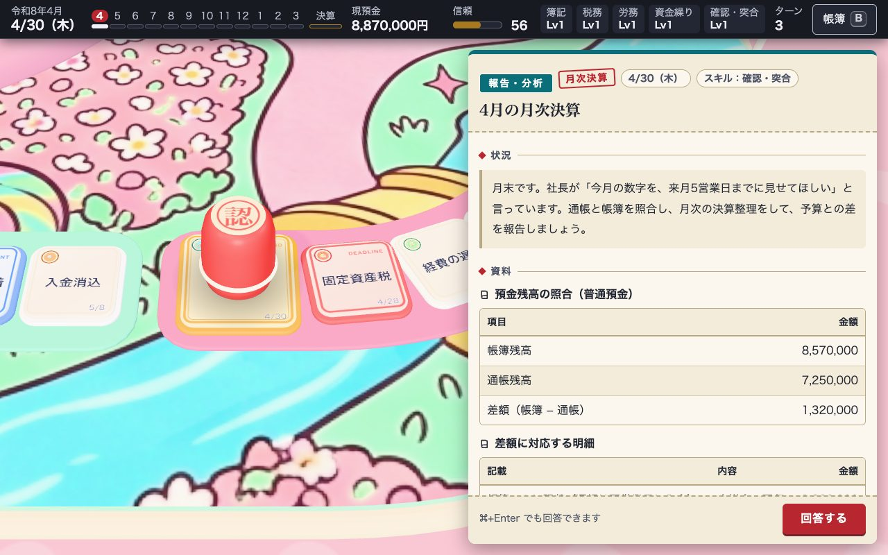
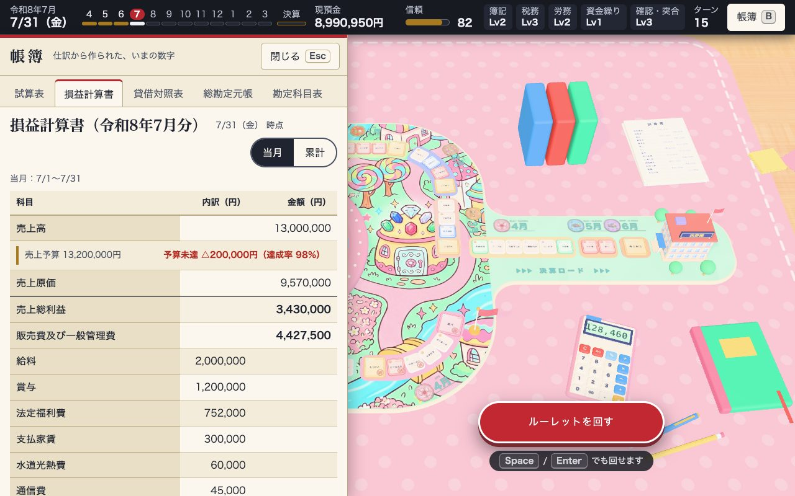
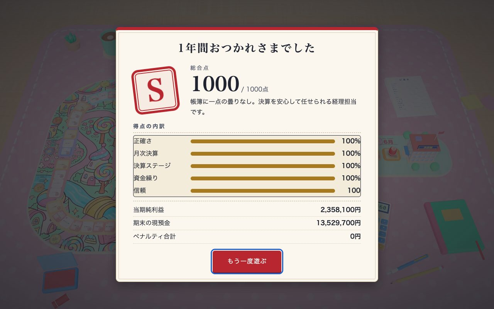

# Closing Quest — 経理の1年間

**ルーレットで進む 3D すごろくで、1年間の経理業務をまるごと体験するゲーム。**
月次決算を毎月のサブゴールに、決算・申告・納付を最終ゴールにしています。



- 仕訳だけではありません。**納税・届出の期限、給与・賞与・年末調整、請求書のチェック、入金消込、資金繰り、予実分析、決算整理、申告と納付**まで、1年を通した経理の仕事が起きます。
- ポップでかわいい机の上のボードゲーム。お菓子の街のマップ、カラフルなルーレット、認印の駒、月ごとのコインのアイコン。
- 帳簿は本物です。定常取引は自動で仕訳され、あなたの回答も帳簿に入ります。試算表・損益計算書・貸借対照表・総勘定元帳をいつでも開いて確かめられます。
- 会社は「ミナト商事株式会社」（従業員 8 名の文具・オフィス用品の卸、3 月決算）。あなたは 4/1 付で着任した経理担当です。

## 遊び方

```bash
npm install
npm run dev     # http://localhost:3100
```

| 操作 | キー |
|---|---|
| ルーレットを回す | `Space` / `Enter` |
| 帳簿（試算表・損益計算書・貸借対照表・元帳・勘定科目表）を開く／閉じる | `B` / `Esc` |
| 回答を送信 | `Ctrl` / `⌘` + `Enter` |
| ヒントを見る（1 段階ごとに −10%） | `H` |

- ルーレットの出目（1〜4）だけ進みます。**期限のマスと月末のマスでは必ず止まります**。飛び越して業務を避けることはできません。
- 止まったマスで「業務カード」が起きます。答えを間違えても 3 回までやり直せます（3 回間違えると正解が自動で帳簿に入り、そのカードは 0 点）。
- 期限を守れなかったカードでは、延滞税などのペナルティ（教育用の金額）が現預金から引かれます。
- 最後に、正確さ・月次決算・決算ステージ・資金繰り・信頼から 1000 点満点で採点されます。

| 業務カードの型 | 内容 |
|---|---|
| 仕訳 | 借方・貸方を入力する（経費精算、賞与、納付、決算整理 など） |
| 期限・提出 | 書類は、いつまでに・どこへ出すか（算定基礎届、法定調書、年末調整 など） |
| 計算 | 給与の控除、年末調整の過不足、中間納付額、減価償却、貸倒引当金 など |
| 突合・確認 | 請求書のチェック、入金消込、預金残高の照合、棚卸差異 |
| 判断 | 修繕費か資本的支出か、資金繰りの優先順位、支払スケジュール など |
| 報告・分析 | 月次決算の報告、予実差異の分析 |
| できごと | 取引先の倒産、請求書の未着、税制改正などの突発イベント |

## 画面

| | |
|---|---|
|  |  |
|  |  |



## 1年の流れ（3月決算・従業員 10 人未満・納期の特例あり）

| 月 | 主な業務 |
|---|---|
| 4 | 着任、固定資産税 第1期、請求書のチェック、経費精算 |
| 5 | 自動車税、入金消込 |
| 6 | 住民税（納期の特例 12〜5 月分）、労働保険の年度更新の開始 |
| 7 | 源泉所得税（納期の特例 1〜6 月分）、算定基礎届、夏季賞与、労働保険料、賞与支払届 |
| 8 | 保険料の年払い、予実差異分析、支払スケジュール |
| 9 | 半期の資金繰り確認、入金遅れへの対応 |
| 10 | 年末調整書類の配布、インボイス・電子帳簿保存法のチェック |
| 11 | 法人税等・消費税の中間申告と納付、年末調整書類の確認 |
| 12 | 住民税（6〜11 月分）、冬季賞与、年末調整 |
| 1 | 源泉所得税（7〜12 月分）、法定調書・給与支払報告書、償却資産の申告 |
| 2 | 固定資産台帳と現物の突合、少額減価償却資産の特例、固定資産税 第4期 |
| 3 | 修繕費か資本的支出か、決算準備、取引先の倒産 |
| 翌 4〜6 | **決算ステージ**：実地棚卸 → 売上原価 → 貸倒引当金 → 消費税の精算 → 法人税等 → 決算書 → 申告・納付 → 株主総会 |

毎月末には**月次決算**（預金残高の照合、月次の決算整理、予算との差の報告）が必ず起きます。

## 内容の正確性

- 期限・要件・金額は、カードごとに**出典と確認日**を表示します。国税庁・厚生労働省・日本年金機構・e-Gov・総務省・東京都主税局などの一次情報で確認できたものは「一次情報」、民間の解説のみのものは「二次情報（一次情報で要確認）」と区別しています。
- 法令は**令和 8 年 4 月 1 日現在**のものに基づきます。
- ゲームとして成り立たせるための簡略化があります（法人税・住民税・事業税を「法人税等」として合算、労働保険料を全額会社負担として扱う、など）。該当するカードの解説に明記しています。
- **学習用のゲームで、税務・労務の助言ではありません。** 実務では、必ず最新の一次情報と専門家（税理士・社会保険労務士）で確認してください。

## 開発

```bash
npm run dev          # 開発サーバー
npm run typecheck    # 型検査（アプリ用と core 用）
npm run validate     # シナリオの整合性チェック
npm run build        # 型検査 + 本番ビルド（dist/）
npm run build:docs   # GitHub Pages 用に docs/ へビルド
```

`npm run validate` は、全問正解で 1 年を最後まで自動で通し、次を確かめます。

- 全仕訳の貸借一致、試算表と貸借対照表の一致
- 納税・賞与などの必須カードが、決まった仕訳を帳簿に入れていること
- 期末の預り金・前払費用などの残高が、翌期の期首につながること
- 現預金がマイナスにならないこと、当期純利益が黒字であること
- 誤答を混ぜても壊れないこと（自動計上の経路）

### 構成

```
src/core/      純 TypeScript（DOM・three に依存しない）
  accounting/  勘定・仕訳・帳簿・試算表・損益計算書・貸借対照表・不変条件
  tasks/       業務カードの型、回答の採点
  game/        状態遷移、盤面、ルーレット、乱数、スコア、ストア
  scenario/    会社の設定、定常取引、月ごとのカード、月次決算、決算ステージ
src/render/    Three.js の 3D（盤面・ルーレット・駒・机・カメラ）
src/ui/        DOM の UI（カード、HUD、帳簿、タイトル、結果）
src/app/       結線（ストア・3D・UI）、セーブ
scripts/       validate.ts（整合性チェック）、build-art-atlas.py（素材のアトラス）
```

- 状態は JSON にできる `GameState`。演出は reducer の外にあり、イベントで通知して `ANIM_DONE` で戻ります。セーブは「ルーレットを回す前」に自動で保存されます。
- カードはデータ駆動です。追加・修正の決まりは [`CONTENT_GUIDE.md`](CONTENT_GUIDE.md)、構成と決まりは [`CLAUDE.md`](CLAUDE.md) を参照してください。
- 開発中は URL に `?debug` を付けると、コンソールの `window.__CQ__` から自動プレイなどが使えます。

### 技術

Three.js（素の WebGL2）/ TypeScript / Vite。3D の形状・材質は手続き生成で、イラスト素材（盤面の絵柄・月と種別のアイコン）は [`public/assets/art/`](public/assets/art) にあります。素材が無くても動きます。

## GitHub Pages

`main` への push で、GitHub Actions（[`build-docs.yml`](.github/workflows/build-docs.yml)）が「型検査 → 整合性チェック → `docs/` へビルド → `docs/` をコミット」を行います。

公開するときは、リポジトリの **Settings → Pages** で、Source を「Deploy from a branch」、Branch を `main`、Folder を `/docs` にしてください（非公開リポジトリで Pages を使うには、有料プランが必要です）。ビルドは相対パスなので、`https://<ユーザー名>.github.io/closing-quest/` のようなサブパスでも動きます。

## クレジット・ライセンス

素材・出典・ライセンスは [`CREDITS.md`](CREDITS.md) にまとめています。

- 盤面の絵柄と月・種別のアイコンは、Gemini（Google）で生成した画像です。**公開・配布する前に、Google の利用規約で生成物の扱いを確認してください。**
- 「人生ゲーム」は商標の可能性があるため、名称・盤面・駒の意匠は使っていません。
- ライセンスは未設定です（現在は非公開で、すべての権利を留保します）。公開するときに決めます。

## これから

- 後処理（被写界深度・ブルーム）、効果音、押印の演出
- 机のテクスチャ、マスコット、突合・判断・報告のアイコンを Gemini で生成し直す
- 英語版
- ライセンスの決定
